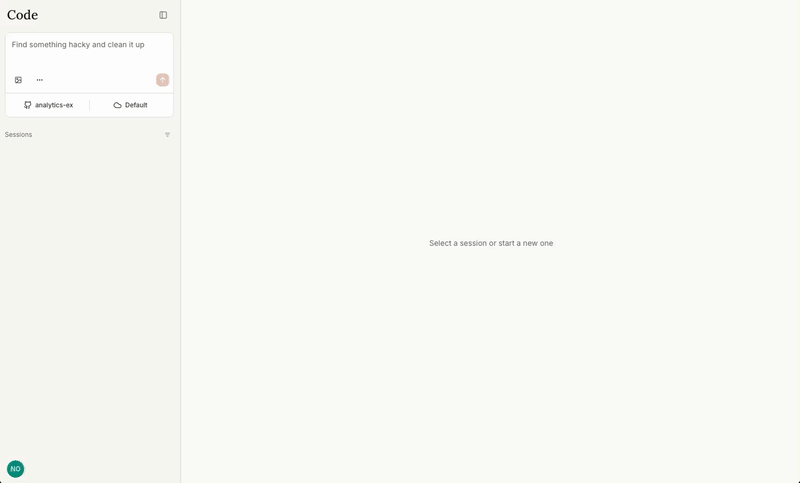

# Agent quickstart

This agent quickstart is a self-hostable app for running sandboxed coding agents, and it's a starting point for building any custom agent. It's heavily inspired by [Claude Code on the web](https://claude.ai/code), and the API is unofficially interoperable with Claude Code.

It's built as a base for quickly prototyping domain-specific custom agents. You can fork this repo, point Claude Code at it, and quickly get to a working and usable prototype.

<p align="center">
  
</p>

This project is not affiliated with nor endorsed by Anthropic. All credit for the API design with which this is interoperable, as well as the UX patterns, go to the Anthropic team. It uses the official Claude Code package, but some of the features it uses are undocumented.

## Getting started

If you just want to try it out, there's a hosted demo at [code.sproutling.dev](https://code.sproutling.dev).

The demo is running on two small VMs with a limited LLM budget, so it's easily overwhelmed. If the demo is out of credits when you visit, you can change the provider to "BYOK" and add your own API key at `Settings > Developer`.

To get started locally:

1. Clone the repository
   ```bash
   git clone https://github.com/lebovic/agent-quickstart.git
   ```
2. Ask Claude Code to set it up! It does pretty well when pointed to `CLAUDE.md`, `docs/setting_up_github.md`, and `docs/design.md`

## How sandboxing works

When a new task is submitted, an agent session is spawned inside of a sandbox. That sandbox is either a Docker container (local or remote host) or a Modal sandbox. (PRs for additional sandboxes welcome!)

To limit the impact of a hijacked session, most credentials live outside of the sandbox. Only one session-scoped temporary authentication token is inside the container boundary. GitHub and Anthropic credentials are outside of the agent's sandbox, and authenticated requests are routed through a credential injecting proxy.

A unique branch that's generated for the session is the only branch to which the agent can push; the git proxy limits push access to the session's branch.

Each session is authenticated with the proxy using a session-scoped JWT. Agent sessions are isolated from the data from other sessions, though they have shared access to the stateful routes within the Anthropic workspace (e.g. `/v1/files`, `/v1/skills`, etc.).

When the agent starts, it pulls the repo, checks out a new branch, and starts Claude Code. Mechanically, this is what the actual Claude Code command looks like:

```bash
TOKEN=temporary-session-scoped-jwt
ANTHROPIC_BASE_URL=https://your-deploy.example.com/api/anthropic
# (More env vars that are variants of the above)

claude \
  --output-format=stream-json \
  --input-format=stream-json \
  --verbose \
  --replay-user-messages \
  --model=claude-opus-4-5-20251101 \
  --sdk-url=wss://your-deploy.example.com/api/v1/session_ingress/ws/session_abc123 \
  --resume=https://your-deploy.example.com/api/v1/session_ingress/session/session_abc123
```

Note that this uses a API key authentication, not the OAuth mechanism that Claude Code uses with `/login`.

## Limitations (and PR ideas!)

There's a lot of low hanging fruit to make this project usable in production:

- Add per-user LLM usage tracking and limits
- Add support for different network access modes (e.g. none, trusted, anything)
- Add dynamic session containers that respect dependency requests (e.g. Node version, Python version)
- Add support for per-environment custom containers
- Add more sandboxing options
- Optimize Modal sandbox startup time
- Add a guide on auth integration for corporate SSO
- Integrate more social SSO logins (e.g. Google, GitHub)
- Add a sandbox spawning agent that opens user-owned compute for remote sandbox spawning
- Integrating the proxy with the Bedrock API
- Integrating the proxy with the Vertex API
- Add safer session rendering to better guard against agent-driven attacks after session hijack
- Add a better getting started guide
- Add a deployment guide
- Limit Anthropic API proxy to stateless routes (e.g. only `/v1/messages` with limited tool use)

Feel free to open issues or PRs!

To make deployment as easy as possible, adding any of the features above should try to avoid adding more services. New UX should be intuitive for users who are used to Claude Code on the Web.

## Security

See SECURITY.md
